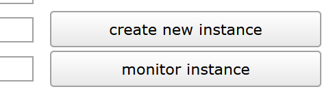
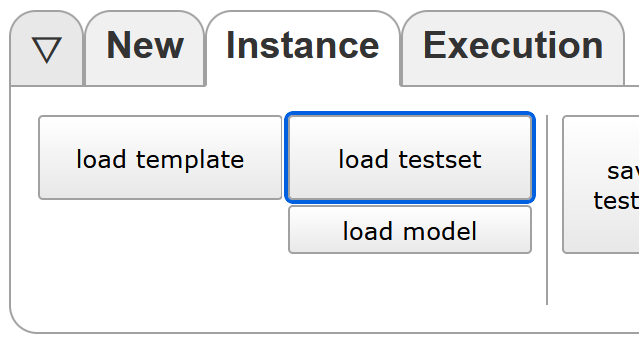
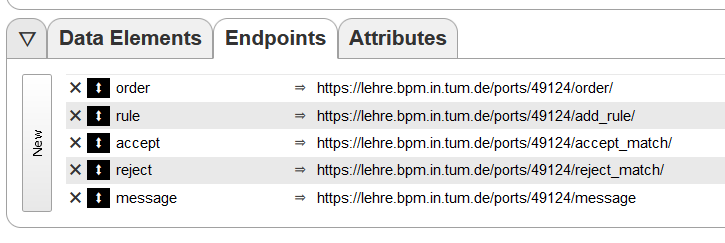
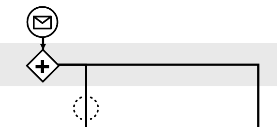
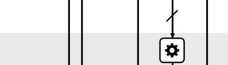
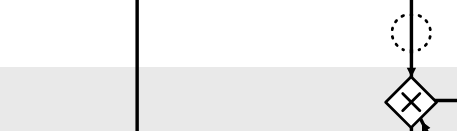

# Ordering system using CPEE, REST and Discord

## Power to the Process - A modularity-focused ordering system for use with robotic bartenders

This project includes a full ordering system that uses the Cloud Process Execution Engine (CPEE) as an connection point to be used with one or more robotic bartenders. On the other side, a Discord bot is used as the user interface for ordering while a REST API connecting the two manages rules, orders and finding matches. The key focus is process-side modularity, as the system is designed to be easily adaptable to different use cases without changing any server-side code.

# Table of Contents
1. [Features](#features)
2. [System Overview](#system-overview)
3. [Installation](#installation)
4. [Usage](#usage)
    - [Initial setup](#initial-setup)
    - [Running the system](#running-the-system)
    - [CPEE Process Walkthrough](#cpee-process-walkthrough)
    - [Make it your own: Usable Service Tasks](#make-it-your-own-usable-service-tasks)
5. [Restrictions](#restrictions)

## Features
- **Power to the Process**: The CPEE instance can independently accept or reject orders.
- **Modular rule system**: The system is easily adaptable without changing any server-side code. The CPEE sets available drinks, receives order data and can make decions based on them.
- **Multi-instance safety**: The system is can handle multiple CPEE instances (= multiple robots). For example, if a robot is busy, the system will automatically find another robot to handle the order.
- **Forgiving ordering via Discord**: Discord acts as the user interface for ordering. Users can make orders by tagging the bot and providing a keyword, no need to remember the exact syntax.
- **No heartbeats**: The system does not require heartbeats to be sent by the CPEE instances making data necessary for ordering the only network traffic.

## System Overview


The **CPEE instances / processes** represent a robotic bartender. They are responsible for communicating with the *Rules* and *Messages REST service* to set available drinks, receive orders, send decisions and update the user about the procgress of their order.

The **Discord bot** acts as the interface for order taking. Users can create orders by tagging the bot and providing a keyword. The bot then sends the order to the *Orders REST service*.

The **Rules / Orders REST services** manage incoming rules and orders. They connect to the *database* to store and retrieve data. When a match occurs (new rule - existing order | new order - existing rule), the information is sent to the CPEE instance. If a new rule / order cannot be matched, it is saved for future use.

The **Messages REST service** is responsible for sending messages to Discord users. In practice, it does not send data do the Discord bot directly but rather uses its token to send direct messages via the Discord API.

The **Database** stores all rules, orders and rejected matches.

## Installation
1. Clone the repository
2. Install the required packages using 
    ```
    pip install -r requirements.txt
    ```
3. Done!

## Usage
### Initial setup
When setting up your system for the first time, you need to take some small extra steps.
1. Configure the `server.py` file with the necessary information.
    - If you don't use a server from https://lehre.bpm.in.tum.de, choose a port for the server to run on. Replace the `::1` with your port.
    - If you don't like the default port, change it to another one.
2. Fill the `config.json` file with the necessary information.
    - `discord_token`: The token of the Discord bot. If you don't have a bot and don't know how to make one, you can follow [this guide](https://discordpy.readthedocs.io/en/stable/discord.html).
    - `optional_guild_id`: This is only necessary if you want to contribute to this project by adding slash commands. Slash commands will be instantly visible in this guild.
    - `rest_order_url`: The URL of the Orders REST service. This depends on your setup in step 1.
3. Invite the Discord bot to your server. Again, if you don't know how to do this, you can follow [this guide](https://discordpy.readthedocs.io/en/stable/discord.html).

### Running the system
After setting up your system, you can start it by follow these steps:

1. Run the `server.py` and `discord_bot.py` files. This will start the REST services and the Discord bot.
    ```
    python server.py
    python discord_bot.py
    ```
2. Set up and start your CPEE instance(s). Do the following for each instance.
    1. Load the testset
        - Head over to https://cpee.org/flow/
        - Using the two buttons on the right, *create a new instance*, type a name in the pop-up (the name of your robot maybe?) and *monitor the instance*.<br>
        
        - You should now see the page for your instance with the tabs *New*, *Instance* and *Execution* at the very top.
        - Click on *load testset* and select the `barbot_testset.xml` file from this repository.<br>
        
    2. Set the relevant variables
        - Click on *Endpoints* in the second row of tabs and adapt the URLs to your server. Note: If you run the code in this repository on the https://lehre.bpm.in.tum.de server, you can use the default URLs.<br>
        
    3. Set the rules and conditions to accept orders. Check TODO
    A
    A
    A
    A
    A

### Making orders
To make an order in a server where the Discord bot is present, all you have to do is send a message in a channel where the bot can read it. The message must contain the following parts. Order does not matter.
- A Discord mention of the bot
- The keyword `order` or `bestell`
- The name of the drink you want to order

Note that sysstem can handle messages that contain more than just the order and the cocktail can have typos. For example, the following messages are all valid orders for a Bacardi (assuming the bot is tagged with `@BarBot`):
- `Wow, today is a nice day. I think it's time for a Bacadi. @BarBot, please order it`
- `Hey @BarBot bestell mir nen Bracsdi`

## CPEE Process Walkthrough
## Process
This is a detailed description of the `barbot_testset.xml` CPEE example process and how it interacts with the REST services.

| Step | Process part | Description |
|------|------|------|
| 1 |  | **Gateway: Parallel**<br>Starting the process, a parallel gateway is opened so the process can handle multiple rules. If you only have one rule, you could also remove it.
| 2 |  | **Gateway: Loop**<br>Start a `while true` loop to keep the process running. Once a rule is processed, the same rule is sent again (in the backend, the old one is deleted)
| 3 |  | **Service Call with Scripts: Endpoint `add_rule`**<br>Make POST request to the Rules REST service to add a rule. When getting a response, save result in the data elements `rule_id`, `order_id`, `user_id`, `cocktail`, `timestamp` and `custom_data`.
| 4 |  | **Script**<br>Using the data elements from the previous step, check if the order should get accepted. Set `data.decision` to `"accept"` or `"reject"`.<br>*Note*: Instead of a small Ruby if-else script, you could also realize this by using extra gateways and script tasks.
| 5 |  | **Gateway: Decision**<br>Continue in a branch based on the value of `data.decision` (`"accept"` or `"reject"`). Here, left is `"accept"` and right is `"reject"`.
| 6 |  | **Service Call: Endpoint `accept_match`**<br>Make POST request to the Orders REST service to accept the match. For this, use the `rule_id` and the `order_id` saved in step 3.
| 7 |  | **Service Call: Endpoint `message`**<br>Make POST request to the Message REST service to send an update message to the discord user. for this, use the `user_id` from step 3.
| 8 |  | **Service Call: Endpoint `timeout`**<br>Wait for X seconds to simulate the robot working. Should be removed in a production environment. Uses the `timeout` endpoint built into the CPEE.
| 9 |  | **Service Call: Endpoint `message`**<br> Send update message to user. See step 7.
| 10 |  | **Service Call: Endpoint `reject_match`**<br>Make POST request to the Orders REST service to accept the match. For this, use the `rule_id` and the `order_id` saved in step 3.<br>*Note*: We are now in the right (`"reject"`)branch of the decision gateway from step 5.
| 11 |  | **Service Call: Endpoint `message`**<br> Send update message to user. See step 7.
| 12 |  | **Gateway: Closing Loop**<br> Close the loop and start again at step 3. In parallel, for the other branch from step 1, continue with step 13.
| 13 |  | **Gateway: Loop**<br>We are now in the second parallel branch and can handle a new rule. The procedure from here on is the same as in the first branch (starting at step 3).

## Make it your own: Usable Service Tasks
If you want to adapt the CPEE process to your own needs, you can use the following service tasks to interact with the REST services. This is a list of all available endpoints and their purpose.

1. **Endpoint: `add_rule`**
    - **Purpose**: Add a new rule to the system.
    - **Method**: POST
    - **Arguments**
        - `strings_to_match`: A string of cocktails that should be matched by the rule. Each option must be separated by commas and a whitespace. Of course, this could also be non-alcoholic drinks or other items.
            - Example values: `Gin Tonic, Vodka Lemon` or `Beer`
        - `rule_id`: The ID of the rule. Is a string. Important: This must be unique, especially if you run multiple instances!
            - Example values: `1` or `"bsdföos9s032nfas09"`
2. **Endpoint: `order`**
    - **Purpose**: Add a new order to the system.
    - **Method**: POST
    - **Arguments**
        - `user_id`: The ID of the user. In our case, this is the Discord user ID.
            - Example values: `298182847173296060` or `"287759958296550548"`
        - `message`: The full message the user sent to the bot. This is used to find the cocktail a user wants.
            - Example values: `<@1189221716887605289> order a cola` or <@1189221716887605289> order a cola
