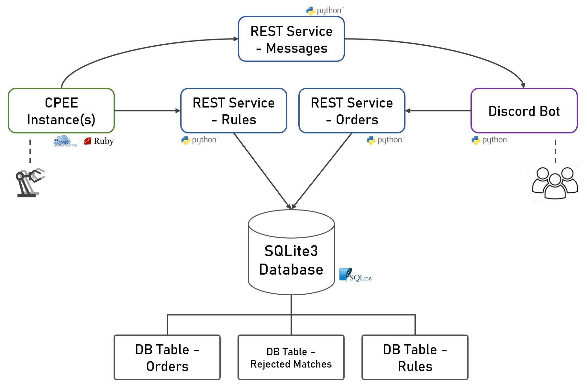

# Ordering system using CPEE, REST and Discord

## Power to the Process - A modularity-focused ordering system for use with robotic bartenders

This project includes a full ordering system that uses the Cloud Process Execution Engine (CPEE) as an connection point to be used with one or more robotic bartenders. On the other side, a Discord bot is used as the user interface for ordering while a REST API connecting the two manages rules, orders and finding matches. The key focus is process-side modularity, as the system is designed to be easily adaptable to different use cases without changing any server-side code.

# Table of Contents
1. [Features](#features)
2. [System Overview](#system-overview)
3. [Installation](#installation)
4. [Usage](#usage)
    1. [Initial setup](#initial-setup)
    2. [Running the system](#running-the-system)
    3. [Making orders](#making-orders)
5. [CPEE Process Walkthrough](#cpee-process-walkthrough)
6. [Make it your own: Adapting the System](#make-it-your-own-adapting-the-system)
    1. [Usable Service Tasks](#usable-service-tasks)
    2. [Changing Rules and Match Conditions](#changing-rules-and-match-conditions)
    3. [Adding Custom Data to Orders](#adding-custom-data-to-orders)
7. [Technical Details](#technical-details)
    1. [database.db](#databasedb)
    2. [discord_bot.py](#discord_botpy)
    3. [REST_service_orders.py](#rest_service_orderspy)
    4. [REST_service_rules.py](#rest_service_rulespy)
    5. [REST_service_messages.py](#rest_service_messagespy)
8. [Design Decisions](#design-decisions)

## Features
- **Power to the Process**: The CPEE instance can independently accept or reject orders.
- **Modular rule system**: The system is easily adaptable without changing any server-side code. The CPEE sets available drinks, receives order data and can make decions based on them.
- **Multi-instance safety**: The system is can handle multiple CPEE instances (= multiple robots). For example, if a robot is busy, the system will automatically find another robot to handle the order.
- **Forgiving ordering via Discord**: Discord acts as the user interface for ordering. Users can make orders by tagging the bot and providing a keyword, no need to remember the exact syntax.
- **No heartbeats**: The system does not require heartbeats to be sent by the CPEE instances making data necessary for ordering the only network traffic.

## System Overview


The **CPEE instances / processes** represent a robotic bartender. They are responsible for communicating with the *Rules* and *Messages REST service* to set available drinks, receive orders, send decisions and update the user about the procgress of their order.  
CPEE in general is a process engine that can be used to model and execute processes. You can find more information about it [here](https://cpee.org/).

The **Discord bot** acts as the interface for order taking. Users can create orders by tagging the bot and providing a keyword. The bot then sends the order to the *Orders REST service*.

The **Rules / Orders REST services** manage incoming rules and orders. They connect to the *database* to store and retrieve data. When a match occurs (new rule - existing order | new order - existing rule), the information is sent to the CPEE instance. If a new rule / order cannot be matched, it is saved for future use.

The **Messages REST service** is responsible for sending messages to Discord users. In practice, it does not send data do the Discord bot directly but rather uses its token to send direct messages via the Discord API.

The **Database** stores all rules, orders and rejected matches.

## Installation
1. Clone the repository
2. Install the required packages using 
    ```
    pip install -r requirements.txt
    ```
3. Done!

## Usage
### Initial setup
When setting up your system for the first time, you need to take some small extra steps.
1. Configure the `server.py` file with the necessary information.
    - If you don't use a server from https://lehre.bpm.in.tum.de, choose a port for the server to run on. Replace the `::1` with your port.
    - If you don't like the default port, change it to another one.
2. Fill the `config.json` file with the necessary information.
    - `discord_token`: The token of the Discord bot. If you don't have a bot and don't know how to make one, you can follow [this guide](https://discordpy.readthedocs.io/en/stable/discord.html).
    - `optional_guild_id`: This is only necessary if you want to contribute to this project by adding slash commands. Slash commands will be instantly visible in this guild.
    - `rest_order_url`: The URL of the Orders REST service. This depends on your setup in step 1.
3. Invite the Discord bot to your server. Again, if you don't know how to do this, you can follow [this guide](https://discordpy.readthedocs.io/en/stable/discord.html).

### Running the system
After setting up your system, you can start it by follow these steps:

1. Run the `server.py` and `discord_bot.py` files. This will start the REST services and the Discord bot.
    ```
    python server.py
    python discord_bot.py
    ```
2. Set up and start your CPEE instance(s). Do the following for each instance.
    1. Load the testset
        - Head over to https://cpee.org/flow/
        - Using the two buttons on the right, *create a new instance*, type a name in the pop-up (the name of your robot maybe?) and *monitor the instance*.  
            
        - You should now see the page for your instance with the tabs *New*, *Instance* and *Execution* at the very top.
        - Click on *load testset* and select the `barbot_testset.xml` file from this repository.  
            
    2. Set the relevant variables
        - Click on *Endpoints* in the second row of tabs and adapt the URLs to your server. Note: If you run the code in this repository on the https://lehre.bpm.in.tum.de server, you can use the default URLs.  
            
    3. Set the rules and conditions to accept orders. Check the section [Changing Rules and Match Conditions](#changing-rules-and-match-conditions) for more information.

### Making orders
To make an order in a server where the Discord bot is present, all you have to do is send a message in a channel where the bot can read it. The message must contain the following parts. Order does not matter.
- A Discord mention of the bot
- The keyword `order` or `bestell`
- The name of the drink you want to order

Note that sysstem can handle messages that contain more than just the order and the cocktail can have typos. For example, the following messages are all valid orders for a Bacardi (assuming the bot is tagged with `@BarBot`):
- `Wow, today is a nice day. I think it's time for a Bacadi. @BarBot, please order it`
- `Hey @BarBot bestell mir nen Bracsdi`

## CPEE Process Walkthrough
This is a detailed description of the `barbot_testset.xml` CPEE example process and how it interacts with the REST services.

| Step | Process part | Description |
|------|------|------|
| 1 |  | **Gateway: Parallel**<br>Starting the process, a parallel gateway is opened so the process can handle multiple rules. If you only have one rule, you could also remove it.
| 2 |  | **Gateway: Loop**<br>Start a `while true` loop to keep the process running. Once a rule is processed, the same rule is sent again (in the backend, the old one is deleted)
| 3 |  | **Service Call with Scripts: Endpoint `add_rule`**<br>Make POST request to the Rules REST service to add a rule. When getting a response, save result in the data elements `rule_id`, `order_id`, `user_id`, `cocktail`, `timestamp` and `custom_data`.
| 4 |  | **Script**<br>Using the data elements from the previous step, check if the order should get accepted. Set `data.decision` to `"accept"` or `"reject"`.<br>*Note*: Instead of a small Ruby if-else script, you could also realize this by using extra gateways and script tasks.
| 5 |  | **Gateway: Decision**<br>Continue in a branch based on the value of `data.decision` (`"accept"` or `"reject"`). Here, left is `"accept"` and right is `"reject"`.
| 6 |  | **Service Call: Endpoint `accept_match`**<br>Make POST request to the Orders REST service to accept the match. For this, use the `rule_id` and the `order_id` saved in step 3.
| 7 |  | **Service Call: Endpoint `message`**<br>Make POST request to the Message REST service to send an update message to the discord user. for this, use the `user_id` from step 3.
| 8 |  | **Service Call: Endpoint `timeout`**<br>Wait for X seconds to simulate the robot working. Should be removed in a production environment. Uses the `timeout` endpoint built into the CPEE.
| 9 |  | **Service Call: Endpoint `message`**<br> Send update message to user. See step 7.
| 10 |  | **Service Call: Endpoint `reject_match`**<br>Make POST request to the Orders REST service to accept the match. For this, use the `rule_id` and the `order_id` saved in step 3.<br>*Note*: We are now in the right (`"reject"`) branch of the decision gateway from step 5.
| 11 |  | **Service Call: Endpoint `message`**<br> Send update message to user. See step 7.
| 12 |  | **Gateway: Closing Loop**<br> Close the loop and start again at step 3. In parallel, for the other branch from step 1, continue with step 13.
| 13 |  | **Gateway: Loop**<br>We are now in the second parallel branch and can handle a new rule. The procedure from here on is the same as in the first branch (starting at step 3).

## Make it your own: Adapting the System
### Usable Service Tasks
If you want to adapt the CPEE process to your own needs, you can use the following service tasks to interact with the REST services. This is a list of all available endpoints and their purpose.

1. **Endpoint: `add_rule`**
    - **Purpose**: Add a new rule to the system.
    - **Method**: POST
    - **Arguments**
        - `strings_to_match`: A string of cocktails that should be matched by the rule. Each option must be separated by commas and a whitespace. Of course, this could also be non-alcoholic drinks or other items.
            - Example values: *Gin Tonic, Vodka Lemon` or `Beer`
        - `rule_id`: The ID of the rule. Is a string. Important: This must be unique, especially if you run multiple instances!
            - Example values: `1` or `"bsdföos9s032nfas09"`
    - **Return Values**
        - `rule_id`, `order_id`, `user_id`, `cocktail`, `timestamp`
        - `custom_data`, a JSON which currently contains a list of roles of the user, their display name and their account creation date.
2. **Endpoint: `order`**
    - **Purpose**: Add a new order to the system.
    - **Method**: POST
    - **Arguments**
        - `user_id`: The ID of the user. In our case, this is the Discord user ID.
            - Example values: `298182847173296060` or `287759958296550548`
        - `message`: The full message the user sent to the bot. This is used to find the cocktail a user wants.
            - Example values: `<@1189221716887605289> order a cola` or `Time for a Bacadi. <@1189221716887605289> order it`
    - **Return Values**
        - A string telling the user what happened to their order (no match -> saved, match -> robot is busy -> saved, etc.)
3. **Endpoints: `accept_match` and `reject_match`**
    - **Purpose**: Accept / reject a match between a rule and an order.
    - **Method**: POST
    - **Arguments**
        - `rule_id`: The ID of the rule.
            - Example values: `1` or `"bsdföos9s032nfas09"`
        - `order_id`: The ID of the order.
            - Example value: `298182847173296060-1228813474612908216-1713042362`
    - **Return Values**
        - A purely informational string containing the result of the operation.
4. **Endpoint: `message`**
    - **Purpose**: Send a message to a user.
    - **Method**: POST
    - **Arguments**
        - `user_id`: The ID of the user.
            - Example values: `298182847173296060` or `287759958296550548`
        - `message`: The message to send to the user.
            - Example values: `Your order is being processed` or `Your order is ready for pickup`
            - Note: To include a data element in the message, use the syntax `#{data.data_element_name}`.  
                For example, `Your order is ready. The cocktail is #{data.cocktail}`.
    - **Return Values**
        - The string `Message sent`

### Changing Rules and Match Conditions
By changing the rules you can define which drinks / items are available. You can simply do this by updating the `strings_to_match` argument in the `add_rule` endpoint.

To change the conditions for accepting an order, you can implement your custom logic after calling the `add_rule` endpoint.  
The most useful data elements for this are the ones returned from the `add_rule` endpoint as described in the chapter [Usable Service Tasks](#usable-service-tasks). If you want more data to base your decisions on, check [Adding Custom Data to Orders](#adding-custom-data-to-orders).  
Just make sure to set the `data.decision` data element to `"accept"` or `"reject"` before the decision gateway.

### Adding Custom Data to Orders
Let's say you want to add additional data to the order data. You can do this by adding a new key-value pair to the `custom_data` JSON object when calling the `/order` endpoint.  
The simplest way to do this is to add a new key-value pair to the `custom_dict` variable in the `on_message` function in the `discord_bot.py` file. This data will then be sent to the CPEE instance with the order and can be used in the process via the `custom_data` data element.

## Technical Details
### database.db
The `database.db` file is a SQLite database that stores all rules, orders and rejected matches. It has three tables: `rules`, `orders` and `rejected_matches`. Here are the columns of each table:
- `orders`
    - `message`: The message that the rule is based on.
    - `user_id`: The ID of the user who sent the message.
    - `timestamp`: The timestamp of the order.
    - `order_id`: The ID of the order.
    - `processing`: A boolean indicating if the order is currently being processed.
    - `custom_data`: A string in JSON format containing additional data.
- `rules`
    - `strings_to_match`: In practice the name of one cocktail (each is saved individually).
    - `callback`: The URL to send the order to.
    - `instance_id`: The ID of the CPEE instance that should handle the order. Used to check if an instance currently fulfills a rule.
    - `rule_id`: The ID of the rule.
    - `processing`: A boolean indicating if the rule is currently being processed.
- `rejected_matches`
    - `order_id`: The ID of the order.
    - `rule_id`: The ID of the rule.

### discord_bot.py
The `discord_bot.py` file is responsible for handling messages from Discord users. It uses the `discord.py` library to interact with the Discord API.  
When a user sends a message, the bot checks if it contains the keyword `order` or `bestell`. If it does, the bot sends the message to the `order` endpoint of the Orders REST service.  
**Methods**
- `on_message`: Called whenever a message is sent in a channel where the bot is present. It checks if the message contains the keyword `order` or `bestell`.  
    If it does, it gathers additional data and sends it to the `order` endpoint of the Orders REST service.
- `hello`: Realizes the `/hello` slash command. It replies with a simple message. Can be used to check if the bot is running.

### REST_service_orders.py
This service is responsible for handling incoming orders and match acceptance / rejection. It uses the `bottle` library to create callable endpoints.  
When a new order is received, the service checks if it can be matched with an existing rule. Four cases can occur and a message is returned accordingly:
1. No match is found. The order is saved for later.
2. A match is found, but the robot is busy. The order is saved for later.
3. A match is found, the robot is free and the callback succeeds.
4. A match is found, the robot is free, but the callback fails. A new match is looked for.  

**Methods:**
- `create_tables`: Creates the necessary database and tables if they don't exist.
- `order`: Entry point for the `/order` endpoint. Saves incoming order to database. Then, calls `handle_order` and returns the result.
- `handle_order`: Handles an order by calling find_matching_rule`, updating the rule status, and possibly sending a callback to CPEE. Returns a message indicating the status of the order.
- `find_matching_rule`: Finds a matching rule for an order by checking all message words (with `len(str) > 3`) for matches. First, tries exact matches, if none are found, tries fuzzy matches. Rules that already rejected the order are ignored. Prefers rules that have `processing == False`.
- `send_matched_rule`: Sends a matched rule to the CPEE instance via the callback url of the rule.
- `accept_match`: Entry point for the `/accept_match` endpoint. Deletes the order. Keeps the rule so `is_instance_busy` can still find it.
- `reject_match`: Entry point for the `/reject_match` endpoint. Saves the rejected match to the database and sets the order status to `processing = False` so it can be matched again.
- Helper functions:
    - `is_instance_busy`: Looks for rules with a specific instance ID that are currently processing.
    - `delete_order`: Deletes order and deletes rejected matches with the order ID. 
    - Others (do what their name suggests): `delete_rule`, `set_order_status`, `set_rule_status`, `save_order`, `match_already_rejected`

### REST_service_rules.py
This service is responsible for handling incoming rules. It uses the `bottle` library to create callable endpoints.  
When a new rule is received, these cases can happen (the rule is always saved, the old one is deleted if it exists):
1. The instance is busy.
2. No match is found. The past 24h of orders are checked for a match. (Reason: The user might have sent an order matching a parallel rule while the instance was busy.)
3. A match is found. The order is sent to the CPEE instance and set to `processing = True`.

**Methods:**
- `add_rule`: Entry point for the `/add_rule` endpoint. Handles the logic described above.
- `find_matching_order`: Same functionality as `find_matching_rule` in the Orders REST service, just reversed.
- Helper functions (do what their name suggests):
    - `save_rule`: Receives a rule containing one or more cocktails. **Saves each cocktail in an individual rule**.
    - `delete_rule`, `set_rule_status`, `set_order_status`, `is_instance_busy`, `match_already_rejected`, `get_past_day_orders`  
        Theoretically, some of these could be imported from a shared file, but for simplicity, they are duplicated.

### REST_service_messages.py
This service is responsible for sending direct messages to Discord users. It uses the `bottle` library to create callable endpoints.  
When a new message is received, the service sends it to the Discord user with the given ID.

**Methods:**
- `message`: Entry point for the `/message` endpoint. Calls `send_discord_message`.
- `send_discord_message`: Sends a message to a Discord user. Uses the Discord API.

## Design Decisions
During development, several design decisions needed to be made. Here are some of the most important ones:
- **Order - Rule Matching**
    - Problem:  
        One design goal of the project was to avoid users having to make orders in a specific format. This means that the system must be able to handle typos and additional text in the order message. Also, two cases must be handled: 1) Searching for a cocktail in all messages in stored orders and 2) searching for all cocktails in a new order message.
    - Options: 
        1. Search for all exact matches using a standard SQLite query. Is very efficient and simple but does not handle typos.
        2. Search for all fuzzy matches by first fetching all orders / rules from the database. Is simple and handles typos but is less efficient.
        3. Use SQLite's full-text search capabilities. This would increase efficiency but can only handle exact matches and ones based on a special query syntax. This would be a problem for the system's forgiving ordering and perfom worse than fuzzy search quality-wise.
        4. Use SQLite's full-text search capabilities with fuzzy matching. For this you would have to a) check & correct each word in a new message for a typo against existing rules and b) check & correct all words in all stored messages for a typo against a new rule. This would have to be done for every new message and every new rule. Overall, due to the same fuzzy matching as in option 2, this would result in the same quality of output. It also trades higher efficieny in some cases for lower efficiency in most cases.
    - Decision:  
        Use a hybrid approach of options 1 and 2. First, search for exact matches. If none are found, search for fuzzy matches. This way, the system can handle typos and additional text in the order message while still being extremely efficient in most cases (no typo) and only slightly less efficient in some cases (typos). it also is simple to implement and understand for future contributors.
- **Rule Trade-off: Simplicity vs. Modularity**
    - Problem:  
        The system should be easily adaptable in terms of rules. This means that a user should not be restricted to a few specific conditions when creating a rule, which would be a bit simpler but also extremely limiting.
    - Options:
        1. Hard-code parameters for rules. This would be the simplest solution but would make the system very inflexible. Any change in the rules would require a change in the server-side code.
        2. Let the process engine handle the rules. This would lead to a very modular system but the process engine would need to be able to accept and reject orders that it receives. This would require a bit more effort in the beginning when creating the process. Also, this creates issues that need to be solved on the server-side as it would need to handle orders taht are rejected by the CPEE instance.
    - Decision:  
        Option 2. The system is designed to be easily adaptable without changing any server-side code. The additional effort in the beginning and during development is worth the flexibility and modularity of the system.
- **Multi-instance Safety**
    - Problem:  
        It is possible to start multiple CPEE instances. If we want to handle that, the system must be able to check if an instance is busy. Especially in combination with the decision from the point before, this leads to difficult situations. For example, two instances have a rule that is the same. What happens if one instance is busy, the other one is free but rejects the order? What happens if both instances are busy? What happens if a rule of a busy instance is matched, that is not the rule that is currently being fulfilled?
    - Options:
        1. Don't allow multiple instances. This would be the simplest solution but would limit the system to only one robot.
        2. Allow multiple instances. This would be the most flexible solution but would require a lot of additional logic to handle all possible cases.
    - Decision:  
        Option 2: Allow multiple instances. The system is designed to be able to handle multiple robots. The additional logic required is worth the flexibility of the system.
- **Handling Busy INstances**
    - Problem:  
        Due to the descision above, the system must be able to handle orders that match a rule of a busy instance.
    - Options:
        1. Let the CPEE instance handle it by sending each match to the instance. Therefore, the instance would need to handle its own state.
        2. Let the server handle it by not sending matches to busy instances. Problem: Server knows when an instance is busy (accepted match) but not when it is free again.
            - 2.1. Let the instance explicitly tell the server when it is free again. This would require an additional REST call.
            - 2.2. Let the server check if an instance is busy by checking if a rule of that instance is currently processing. This would require additional logic in the server.
    - Decision:  
        Option 2.2. Let the server check if an instance is busy. This works by setting rules to `processing = True` when they are matched. They then stay in this state until they are deleted, which happens when the same rule is added again and the instance can 100% receive orders again. It is an efficient solution and requires the least additional logic on the instance side.